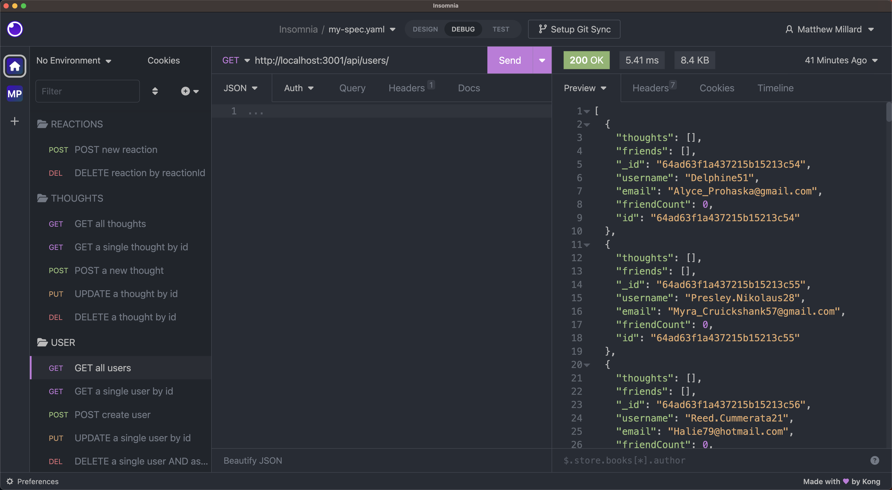

# Social Connect API

## Description

This repository houses the challenge to build an efficient and robust API for a social network application, leveraging MongoDB and the Mongoose ODM. The API is designed to enable sharing thoughts, reacting to posts, and managing friend lists.

## Table Of Contents

- [Project Setup Guide](#project-setup-guide)
- [Screenshots](#screenshots)
- [Usage Guide](#usage-guide)
- [Links](#links)
- [Technologies Used](#technologies-used)
- [Node Packages Used](#node-packages-used)
- [Contribution](#contribution)
- [License](#license)
- [Questions](#questions)

## Project Setup Guide

1. Clone the repository

   _Open the terminal and run the following command:_

   `git clone git@github.com:matthew-millard/social-connect-api.git`

2. Navigate into the project directory

   `cd social-connect-api`

3. Install Node.js and npm

   If you haven't installed Node.js and npm, you can download them from [here](https://nodejs.org/en). _npm comes with Node.js_

4. Install the dependencies

   In the project directory, run the following command to install all the necessary dependencies:

   `npm install`

5. Set up MongoDB

   If you haven't installed MongoDB, download and install it from [here](https://www.mongodb.com/try/download/community). After installing, make sure MongoDB is running.

6. Set up the environment variables

   Create a '.env' file in the root of your project directory and add your environment variable:

   `URI_MONGODB='mongodb://127.0.0.1:27017/social-connect'`

7. Seed the database

   You can run the script to seed the database with fake data by running the command: `npm run seed`.

8. Run the application

   `npm start`

9. Test the API

   Use a tool like Insomnia or Postman to test the API endpoints.

## Screenshots

## Usage Guide

This API supports the following operations:

### User Operations

#### Get All Users

    Send a GET request to /api/users

#### Get A User By ID

    Send a GET request to /api/users/:userId.

#### Create A User

    Send a POST request to /api/users
    with a JSON body containing the username and email

    {
    "username": "john.doe",
    "email": "john.doe@gmail.com"
    }

#### Update A User

    Send a PUT request to /api/users/:userId
    with a JSON body containing fields you want to update.

#### Delete A User And Associated Thoughts

    Send a DELETE request to /api/users/:userId.

#### Add A Friend

    Send a PUT request to /api/users/:userId/friends/:friendId

#### Delete A Friend

    Send a DELETE request to /api/users/:userId/friends/:friendId

### Thought Operations

#### Get All Thoughts

    Send a GET request to /api/thoughts

#### Get A Thought By Id

    Send a GET request to /api/thoughts/:thoughtId

#### Create A New Thought

    Send a POST request to /api/thoughts/
    with a JSON body containing the following:

    {
    "thoughtText": "Your thought message here",
    "username": "Thought Author here",
    "userId": "Thought Author id here"
    }

#### Update A Thought By Id

    Send a PUT request to /api/thoughts/:thoughtId
    with a JSON body containing the following:

    {
    "thoughtText": "Updated thought message here",
    "username": "Thought Author here",
    "userId": "Thought author id here"
    }

#### Delete A Thought By Id

    Send a DELETE request to /api/thoughts/:thoughtId

### Reactions

#### Create A New Reaction

    Send a POST request to api/thoughts/thoughtId/reactions
    with a JSON body containing the following:

    {
    "reactionBody": "Reaction to thought here",
    "username": "Reaction Author here"
    }

#### Delete A Reaction By Id

    Send a DELETE request to api/thoughts/:thoughtId/reactions/reactionId

*Please make sure to replace :userId, :thoughtId, and :reactionId with actual IDs you have in your database.*

## Links

[Social Connect API Walkthrough Demonstration](https://drive.google.com/file/d/1uQRBB_qc3sJZv411zEVEodVCLmgt5alR/view)

[Social Connect API Github Repository Link](https://github.com/matthew-millard/social-connect-api)

## Technologies Used

- NodeJS

- JavaScript

- VS Code

- Insomnia

- MongoDB

- Mongoose

- Mongo Compass

## Node Packages Used

- dotenv ^16.3.1
- express ^4.18.2
- faker ^5.5.3
- mongoose ^7.3.1
- nodemon ^1.14.9

## Contribution

You're welcome to contribute to this project in several ways: you can help identify and resolve bugs or suggest new features, review and suggest modifications to the code, or enhance the project's documentation. All of these contributions can be made through submitting pull requests.

## License

MIT License A short and simple permissive license with conditions only requiring preservation of copyright and license notices. Licensed works, modifications, and larger works may be distributed under different terms and without source code.

## Questions

If you have any questions related to this project, please don't hesitate to [email me](matthew.richie.millard@gmail.com).

If you would like to check out my other projects on Github: [matthew-millard](https://github.com/matthew-millard).